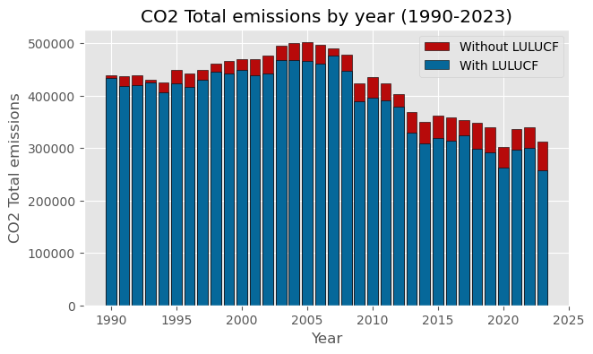

# CO₂ Emissions in Italy (1990–2023)

## Project Overview
This project analyzes Italy’s CO₂ emission trends using official data from ISPRA (Italian Institute for Environmental Protection and Research), the national authority responsible for greenhouse gas inventories.  
The purpose of this project is to demonstrate skills in data wrangling and visualization using real-world datasets. 

## Data
- Source: ISPRA (CRF tables 1990–2023)  
- Raw data (Excel)  
- Preprocessing script (`extraction.py`)  
- Processed data (CSV)

## Analysis
This project analyzes CO₂ emissions in Italy from 1990 to 2023.  
It visualizes the trend of national emissions over the years with charts ant tables, showing their reduction also in correlation with major EU policies.  
In addition, the projects takes into consideration the contribution of LULUCF in reducing CO₂ emissions across the years.

## Visualizations
  
Total emissions over the years 1990-2023. Major policies and events are anntoated on the chart.


  
Total national emissions 1990-2023. Comparison with and without LULUCF

## Requirements
numpy
pandas
matplotlib

Install manually or with:

```bash
pip install -r requirements.txt
```

## Raw data
The project already provides the cleaned and extracted data.  
It also contains the raw data, making it possible to rebuild the file.  
In that case, all that is needed is to run scripts/extraction.py

## References
[Raw data source (ISPRA)](https://emissioni.sina.isprambiente.it/inventario-nazionale/#Report)

## Disclaimer
This a portfolio project meant to show data wrangling and analysis skills, not a full analysis on italian climate policies on greenhouse gas emissions.